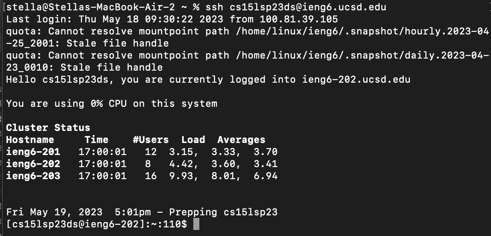
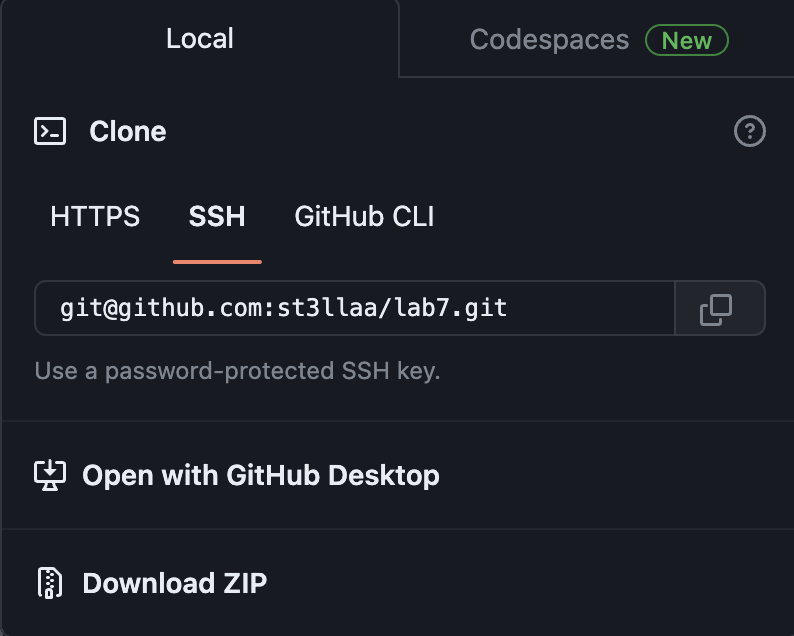
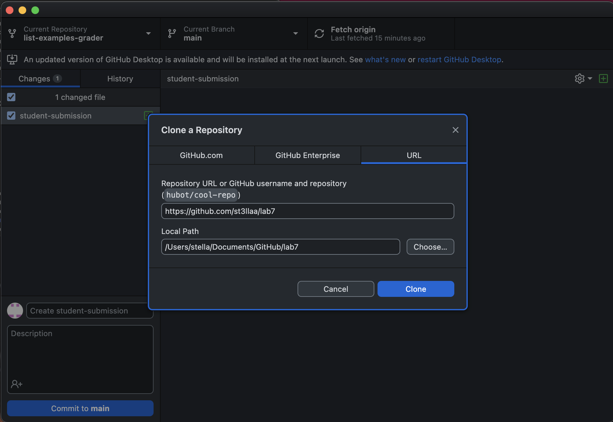
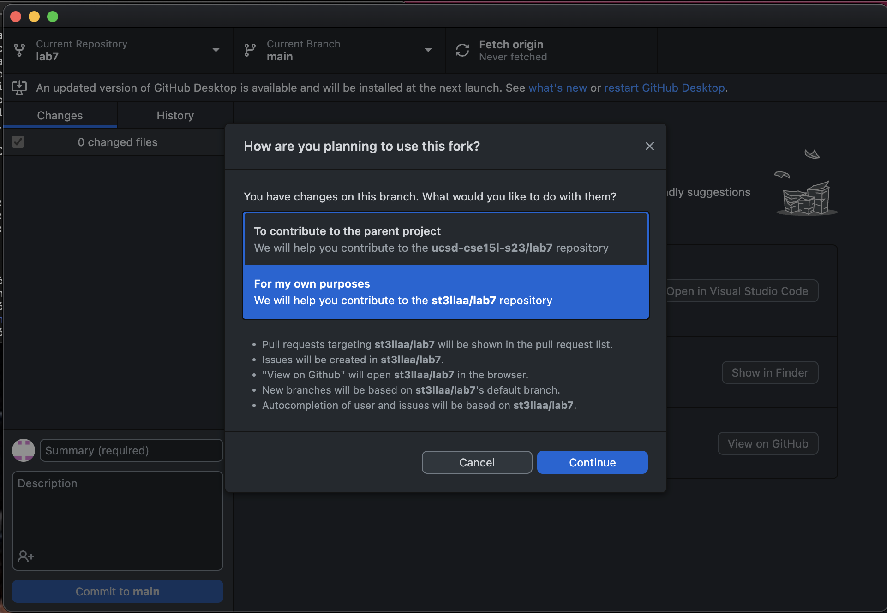
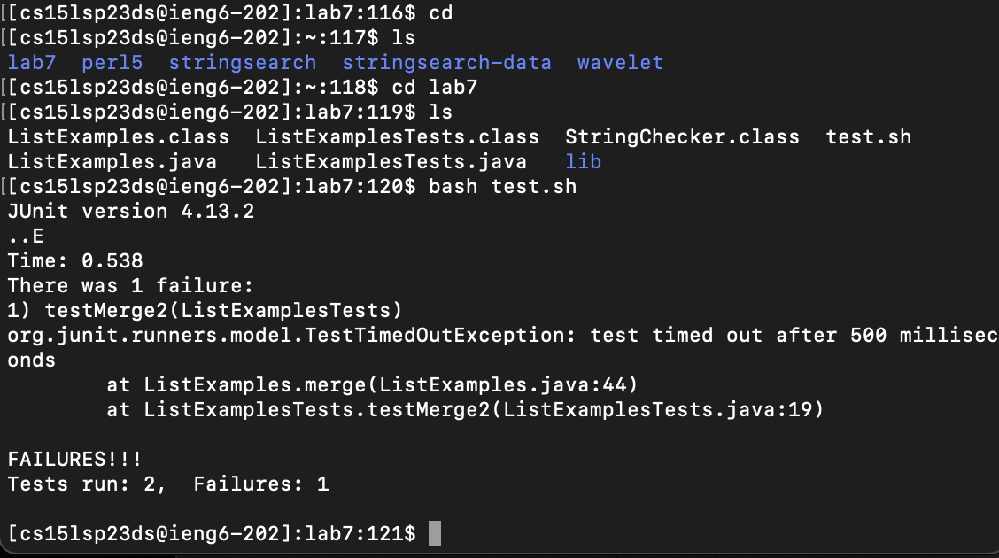
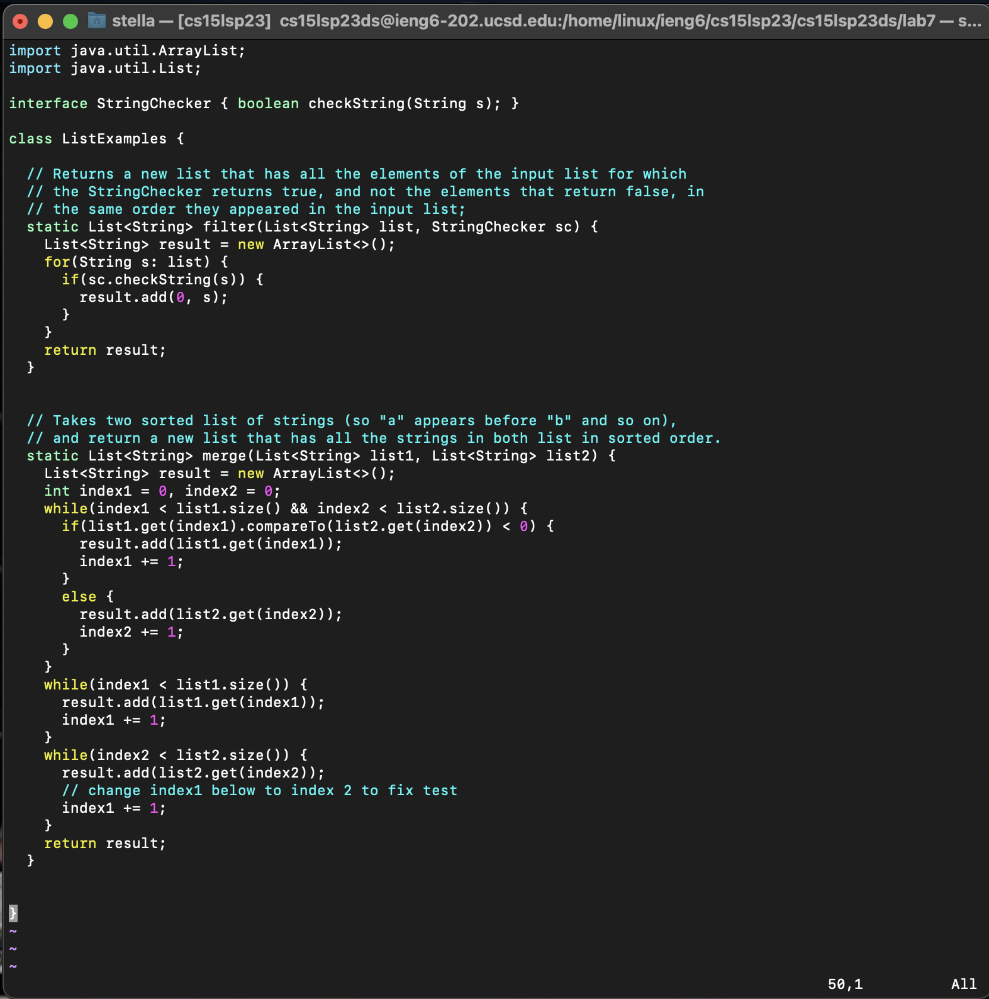
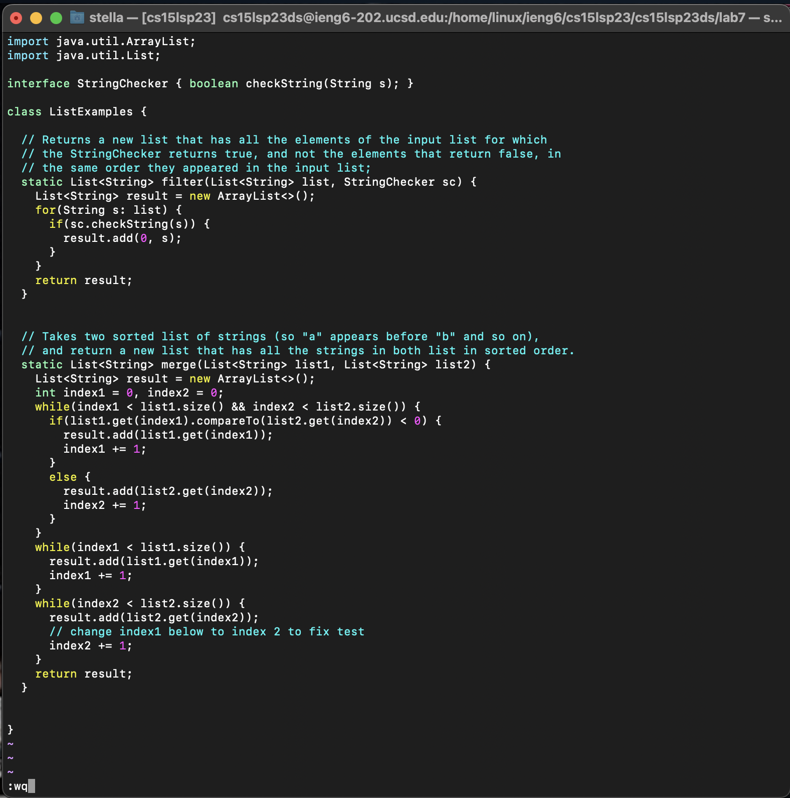
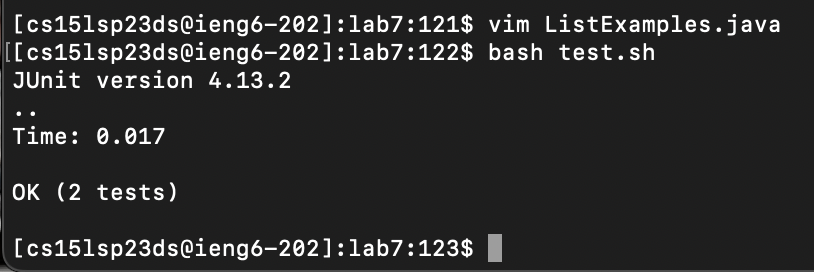
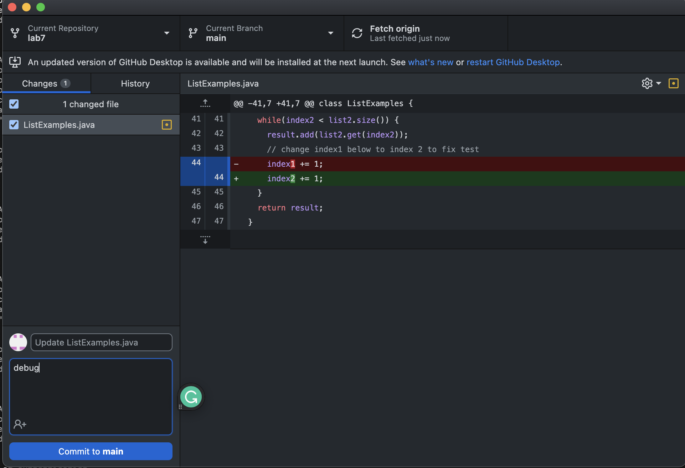
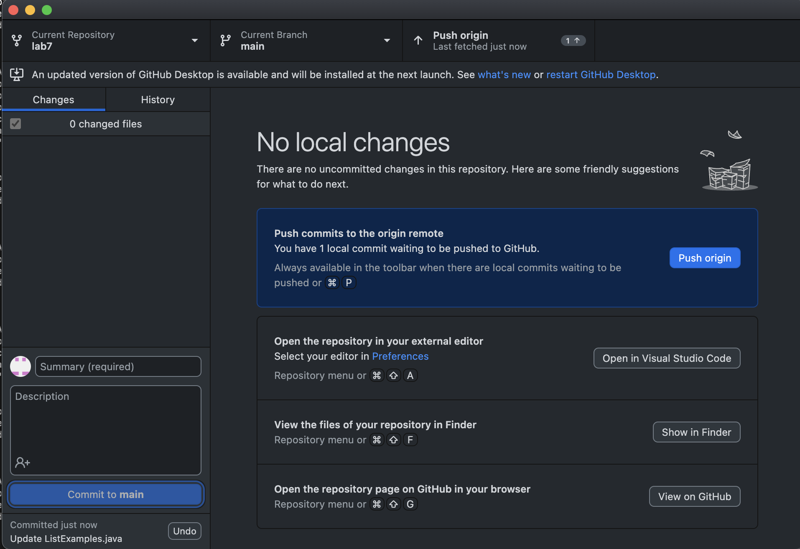

# Lab Report 4: Command Line

1. Log into ieng6

Logging into the ieng6 means accessing the remote computer in the CSE lab which requires SSH (secure shell) with my course specific account
Command: ```$ ssh cs15lsp23ds@ieng6.ucsd.edu ``` + ```<enter>``` This no longer requires a password as I set up an SSH key for the ieng6 which means that my private key acts as the authentification. 


2. Clone your fork of the repository from your Github account

As I have already created a fork of the code, to make a clone of this fork I go into my Github account and click on the green code button. As I have set up SSH key for GitHub, I can access my GitHub account through my course specific account. This means I can use SSH clone URLs as well as the https clone URLs. 
As the screenshots demonstrate, I did this step through GitHub desktop. Which I accessed by pressing the "open with GitHub Desktop" option which opens the application. Once this was done it prompted me to clone the repo and asked whether I wanted to modify the origional or a copy. Cloning from the command line using the line ```git clone <repo to clone> ``` would be more efficient but I chose to use gitdesktop for the sake of this lab.

**Options for cloning:** 

**GitHub Desktop:** 

**Git message about editing:** 

3. Run the tests, demonstrating that they fail

This step I first ran the command ```$ cd lab7``` which switched my directory into the directory with the code and test (lab7). Next I ran the test: ```bash test.sh``` which runs the command line code to compile and run the JUnit tests. This resulted in 2 test failures, as the output demonstrated.


4. Edit the code file to fix failing tests

In order to edit the code without using a text editor such as VSCode or Eclipse I ran the ```$ vim <fileName> ``` command which in this case takes the arguement "ListExamples.java" as this is the file in which the faiulure enducing code is located. After execuyting this command the java file appeared in the terminal. The defualt vim is in normal mode which doens't support edits to the code. 
Vim normal mode: 
To switch the index1 to index2 I put vim in insert mode by pressing ```<i>``` while over the text I wanted to change. I navigated to this text by using the ```<j>```, ```<h>``` keys, which required many recurrsive presses of these keys. Another faster approach would be to use the ```Ctrl-A``` and ```Ctrl-E``` commands to skip to the end and beggining of lines accordingly without having to go through every element in the line of code. Once the change was made, I move out of insert mode using the ```<esc>``` key. I then saved and left vim using ```$:wq``` command. 
Vim save (normal mode): 

5. Run the test, demonstrating that they now succeed

Again (in the correct directory --> lab7), I ran the ```$ bash test.sh ``` command to run the test and as the screenshot shows, the test passed.


6. Commit and push the resulting change to your GitHub account

To commit and push I first check the status of git to see the changes that remained unpushed. This was done with the command ```$ git status ```. Then I pushed the changes using the GitHub desktop

Then I pushed the changes with the commit message "debug". Alternatively the command line commands for adding files: ``` git add <fileName> ```, commiting: ```git commit -m "commit message"```, and pushing to git: ```git push <remote> <branch>``` would work as well as using git desktop.

